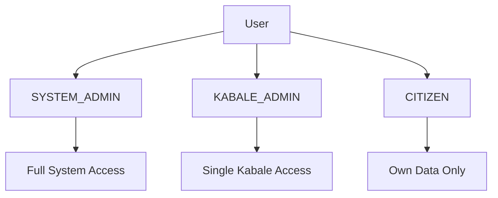
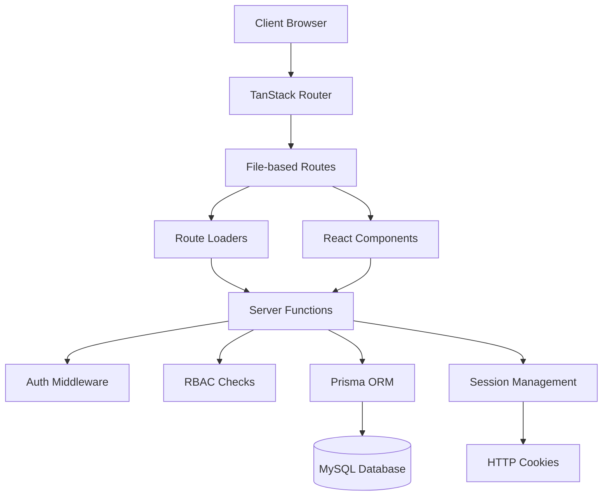
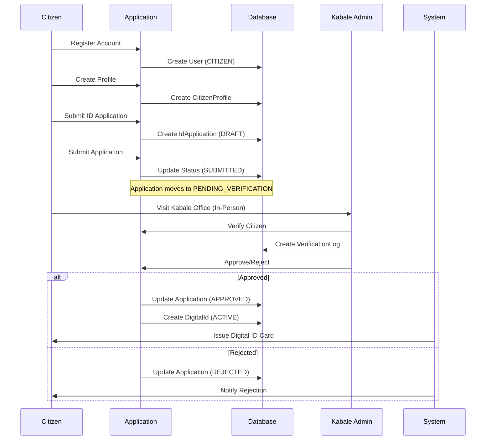
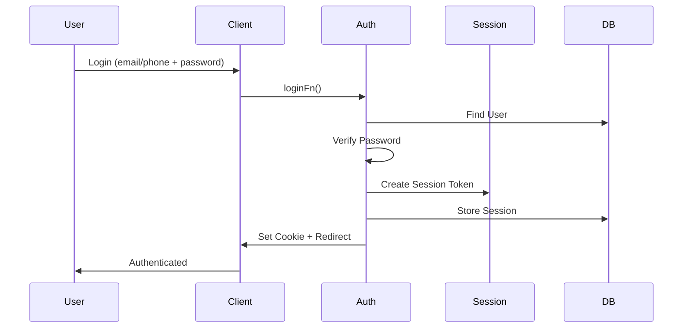
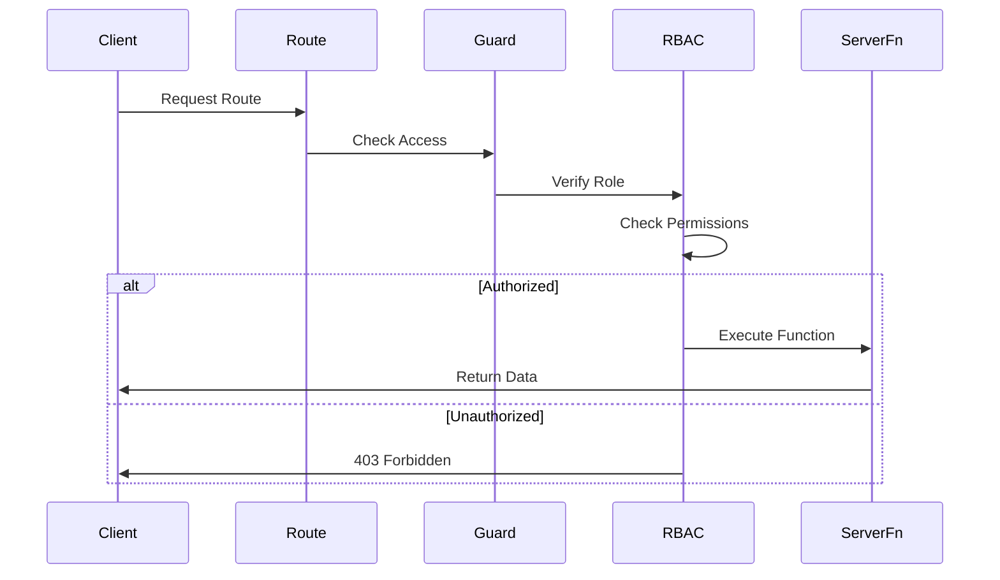
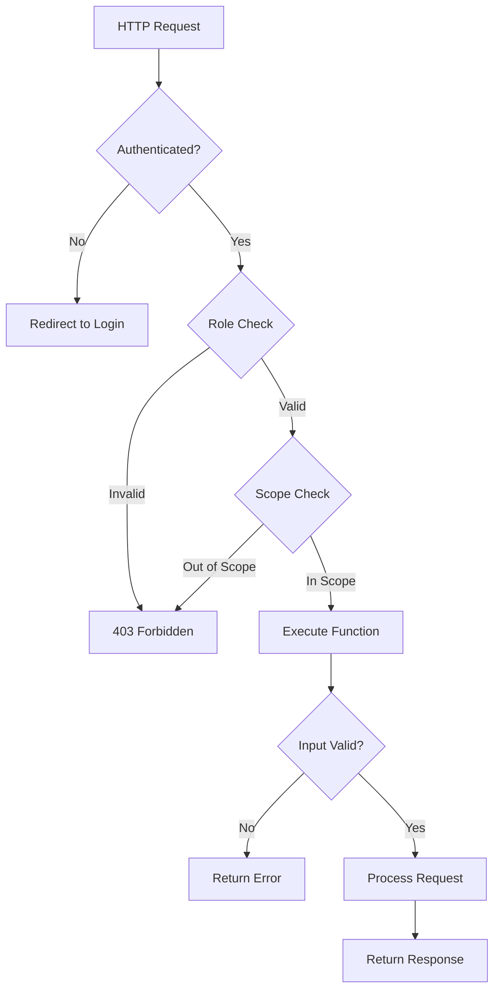
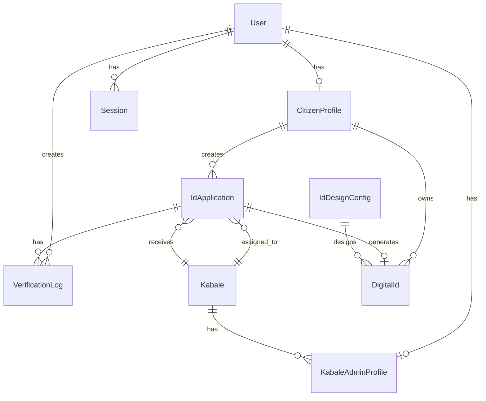
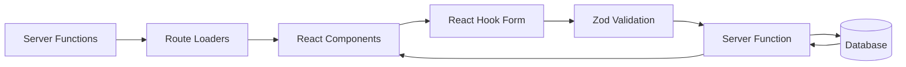

# Architecture Documentation

## Table of Contents

- [System Overview](#system-overview)
- [Role-Based Access Control (RBAC)](#role-based-access-control-rbac)
- [System Architecture](#system-architecture)
- [Data Flow](#data-flow)
- [Component Architecture](#component-architecture)
- [Security Model](#security-model)
- [Database Relationships](#database-relationships)

## System Overview

The Kabale Digital ID Card system is a single-city digital identity platform built with TanStack Start. The system follows a three-tier role-based architecture where:

- **Citizens** register online and apply for digital IDs
- **Kabale Administrators** verify citizens in person and approve/reject applications
- **System Administrators** manage the entire system

### Core Principles

1. **Single City Model**: There is no City entity - Kabales are the highest geographic unit
2. **Role-Based Authorization**: All access is controlled by user roles
3. **In-Person Verification**: ID approval requires physical presence at a Kabale office
4. **Immutable Audit Logs**: All verification actions are logged and cannot be modified
5. **Kabale Scoping**: Kabale Admins can only access data for their assigned Kabale

## Role-Based Access Control (RBAC)

### User Roles



### Permission Matrix

| Action | SYSTEM_ADMIN | KABALE_ADMIN | CITIZEN |
|--------|-------------|--------------|---------|
| View all Kabales | ✅ | ❌ | ❌ |
| View own Kabale | ✅ | ✅ | ❌ |
| Create/Edit Kabales | ✅ | ❌ | ❌ |
| Assign Kabale Admins | ✅ | ❌ | ❌ |
| View all applications | ✅ | Only own Kabale | Only own |
| Verify applications | ✅ | Only own Kabale | ❌ |
| Approve/Reject IDs | ✅ | Only own Kabale | ❌ |
| Revoke Digital IDs | ✅ | ❌ | ❌ |
| View own profile | ✅ | ✅ | ✅ |
| Create ID application | ❌ | ❌ | ✅ |
| View own applications | ❌ | ❌ | ✅ |

### RBAC Implementation

The RBAC system is implemented through:

1. **Server Functions**: Middleware-based authorization (`requireSystemAdminMiddleware`, `requireKabaleAdminMiddleware`, `requireCitizenMiddleware`)
2. **Route Guards**: Loader-level protection using `withSystemAdmin`, `withKabaleAdmin`, `withCitizen` wrappers
3. **Data Scoping**: `getKabaleScopeFilter()` ensures Kabale Admins only see their Kabale's data
4. **Access Validation**: `requireKabaleAccess()` validates Kabale-specific operations

Key files:
- `src/server/rbac.ts` - RBAC utilities and scoping
- `src/server/auth-context.ts` - Authentication context and role checks
- `src/server/route-guards.ts` - Route-level guards

## System Architecture

### High-Level Architecture



### Application Layers

1. **Presentation Layer** (`src/routes/`, `src/components/`)
   - React components with TanStack Router
   - File-based routing
   - Client-side state management

2. **Application Layer** (`src/server/`)
   - Server functions (TanStack Start)
   - Business logic
   - Authorization and validation

3. **Data Layer** (`src/db.ts`, `prisma/`)
   - Prisma ORM
   - Database schema
   - Migrations

## Data Flow

### ID Application Workflow



### Authentication Flow



### Authorization Flow



## Component Architecture

### Route Structure

```
src/routes/
├── __root.tsx              # Root layout with Header/Footer
├── index.tsx               # Landing page
├── login.tsx               # Authentication
├── register.tsx            # Citizen registration
├── register-profile.tsx    # Profile creation
├── profile.tsx             # User profile management
├── forbidden.tsx           # 403 error page
│
├── admin/                  # System Admin Routes
│   ├── route.tsx          # Admin layout guard
│   ├── index.tsx          # Admin dashboard
│   ├── kabales/          # Kabale management
│   ├── users/            # User management
│   ├── applications/      # All applications
│   ├── citizens/         # All citizens
│   ├── digital-ids/      # All digital IDs
│   └── id-design/        # ID card design
│
├── citizen/               # Citizen Routes
│   ├── index.tsx         # Citizen dashboard
│   └── applications.tsx    # Citizen's applications
│
└── kabale/                # Kabale Admin Routes
    ├── route.tsx         # Kabale admin layout guard
    ├── index.tsx         # Kabale admin dashboard
    ├── applications.tsx  # Kabale's applications
    ├── citizens/         # Kabale's citizens
    └── digital-ids.tsx   # Kabale's digital IDs
```

### Server Function Organization

```
src/server/
├── auth.ts                # Authentication functions
├── auth-context.ts        # Auth context and user retrieval
├── auth-utils.ts          # Password hashing, user lookup
├── session.ts             # Session management
├── rbac.ts                # Role-based access control
├── route-guards.ts        # Route-level guards
├── server-guards.ts       # Server function guards
│
├── citizen.ts             # Citizen-related functions
├── kabales.ts             # Kabale-related functions
└── system.ts              # System admin functions
```

## Security Model

### Authentication

- **Password Hashing**: Argon2 algorithm for secure password storage
- **Session Management**: Token-based sessions stored in database
- **Cookie Security**: HTTP-only cookies for session tokens
- **Session Expiration**: Configurable expiration times

### Authorization

- **Middleware Pattern**: Server functions use middleware for auth checks
- **Route Guards**: Loader-level protection prevents unauthorized access
- **Data Scoping**: Automatic filtering based on user role
- **Kabale Isolation**: Kabale Admins cannot access other Kabales' data

### Security Best Practices

1. **Never Trust Client**: All authorization checks happen server-side
2. **Principle of Least Privilege**: Users only get minimum required access
3. **Immutable Logs**: Verification logs cannot be modified
4. **Input Validation**: Zod schemas validate all inputs
5. **SQL Injection Protection**: Prisma ORM prevents SQL injection
6. **XSS Protection**: React automatically escapes content

### Security Flow



## Database Relationships

### Entity Relationship Overview



### Key Relationships

1. **User → Profiles**: One-to-one relationships (optional)
   - A User can have either a CitizenProfile OR KabaleAdminProfile
   - System Admins have neither profile type

2. **Kabale → Applications**: One-to-many
   - Each application belongs to one Kabale
   - Kabale deletion is restricted if applications exist

3. **Citizen → Applications**: One-to-many
   - Citizens can have multiple applications (but only one active ID)
   - Applications cascade delete with citizen profile

4. **Application → DigitalId**: One-to-one (optional)
   - Only approved applications have a DigitalId
   - DigitalId creation is tied to application approval

5. **Application → VerificationLogs**: One-to-many
   - Immutable logs of all verification actions
   - Logs cascade delete with application

### Data Integrity Constraints

- **Unique Constraints**: Email, phone, session tokens
- **Foreign Key Constraints**: Cascade deletes for user-related data
- **Restrict Constraints**: Prevent deletion of Kabales with applications
- **Indexes**: Optimized queries on email, phone, role, status fields

For detailed database schema information, see [Database Documentation](DATABASE.md).

## State Management

### Application State

- **Server State**: Managed through TanStack Router loaders and server functions
- **Client State**: React hooks and context (AuthContext)
- **Form State**: React Hook Form with Zod validation
- **Session State**: Stored in HTTP cookies and database

### State Flow



## Performance Considerations

1. **Database Indexing**: Strategic indexes on frequently queried fields
2. **Parallel Queries**: Promise.all() for independent database operations
3. **Lazy Loading**: Route-based code splitting
4. **Caching**: Session caching in development
5. **Query Optimization**: Prisma query optimization with selective includes

## Scalability

The system is designed to scale horizontally:

- **Stateless Server Functions**: Can run on multiple instances
- **Database Connection Pooling**: Prisma handles connection pooling
- **Load Balancing**: Support for multiple server instances (see `loadbalancer.js`)
- **Session Storage**: Database-backed sessions work across instances

For deployment details, see [Deployment Guide](DEPLOYMENT.md).

