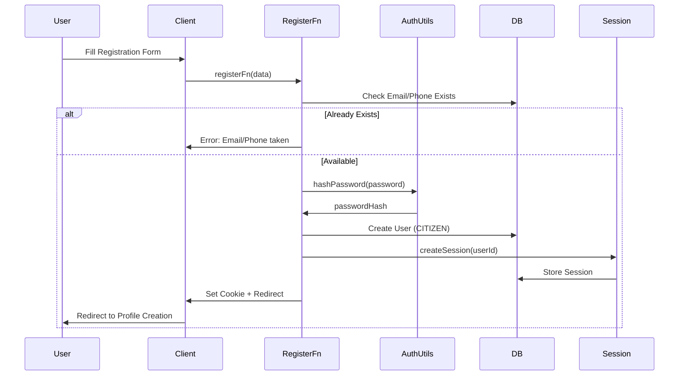
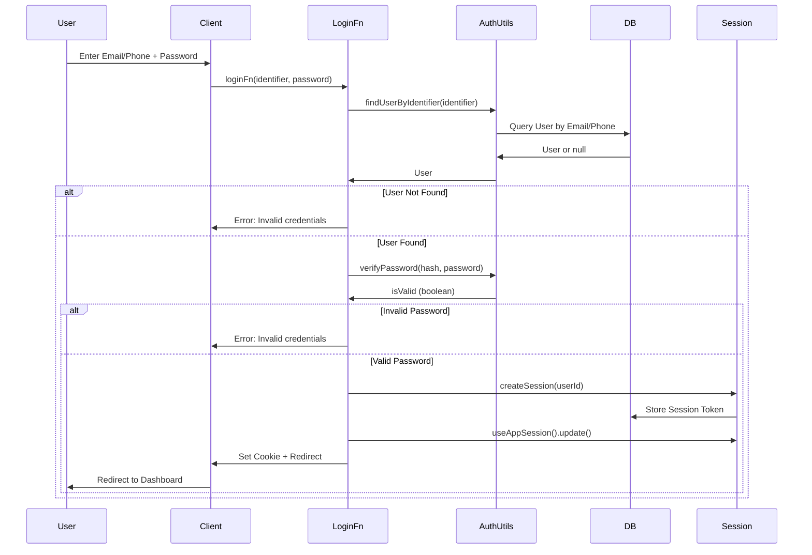
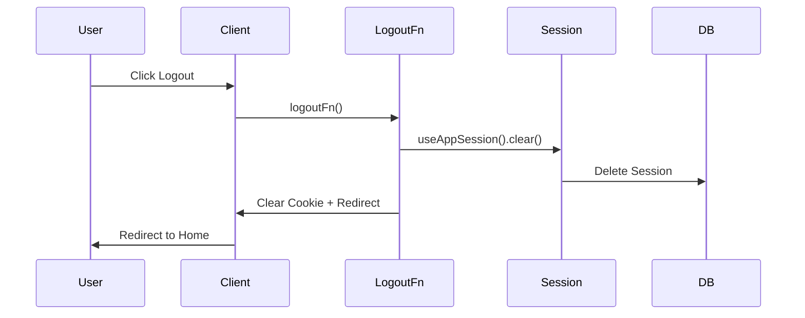

# Authentication & Authorization Documentation

## Table of Contents

- [Overview](#overview)
- [Authentication Flow](#authentication-flow)
- [Session Management](#session-management)
- [Password Security](#password-security)
- [Role-Based Authorization](#role-based-authorization)
- [Route Guards](#route-guards)
- [Server Function Protection](#server-function-protection)
- [Security Best Practices](#security-best-practices)

## Overview

The Kabale Digital ID Card system implements a secure authentication and authorization system using:

- **Password Hashing**: Argon2id algorithm for secure password storage
- **Session Management**: Token-based sessions stored in database
- **Cookie-Based Auth**: HTTP-only, secure cookies for session tokens
- **Role-Based Access Control**: Three-tier role system with granular permissions

## Authentication Flow

### Registration Flow



### Login Flow



### Logout Flow



## Session Management

### Session Structure

Sessions are stored in the database with the following structure:

```typescript
type Session = {
  id: string;              // CUID
  userId: string;          // Foreign key to User
  token: string;           // Unique session token (64 hex chars)
  expiresAt: DateTime;     // Expiration timestamp
  createdAt: DateTime;
  updatedAt: DateTime;
}
```

### Session Configuration

Sessions use secure cookie configuration:

```typescript
{
  name: 'app-session',
  password: process.env.SESSION_SECRET,  // 32+ character secret
  cookie: {
    secure: process.env.NODE_ENV === 'production',  // HTTPS only in production
    sameSite: 'lax',        // CSRF protection
    httpOnly: true,         // XSS protection (not accessible via JavaScript)
    maxAge: 7 * 24 * 60 * 60,  // 7 days
  }
}
```

### Session Lifecycle

1. **Creation**: When user logs in, a session token is generated and stored
2. **Validation**: Each request validates the session token from cookie
3. **Expiration**: Sessions expire after 7 days (configurable)
4. **Cleanup**: Expired sessions are automatically deleted on validation

### Session Functions

**Key Functions** (`src/server/session.ts`):

- `createSession(userId)`: Creates a new session and returns token
- `getSession(token)`: Retrieves session by token, checks expiration
- `deleteSession(token)`: Deletes a specific session
- `deleteUserSessions(userId)`: Deletes all sessions for a user
- `cleanupExpiredSessions()`: Removes expired sessions (for cron jobs)

### Session Token Generation

Session tokens are cryptographically secure:

```typescript
function generateSessionToken(): string {
  const randomBytes = new Uint8Array(32);
  crypto.getRandomValues(randomBytes);
  return Array.from(randomBytes, (byte) => 
    byte.toString(16).padStart(2, '0')
  ).join('');
}
```

- **Length**: 64 hexadecimal characters (32 bytes)
- **Entropy**: Cryptographically secure random generation
- **Uniqueness**: Enforced by database unique constraint

## Password Security

### Password Hashing

Passwords are hashed using **Argon2id**, a memory-hard password hashing function:

```typescript
async function hashPassword(password: string): Promise<string> {
  return await argon2.hash(password, {
    type: argon2.argon2id,      // Argon2id variant (resistant to both GPU and side-channel attacks)
    memoryCost: 65536,           // 64 MB memory cost
    timeCost: 3,                 // 3 iterations
    parallelism: 4,             // 4 parallel threads
  });
}
```

### Password Verification

```typescript
async function verifyPassword(hash: string, password: string): Promise<boolean> {
  try {
    return await argon2.verify(hash, password);
  } catch {
    return false;  // Fail securely on errors
  }
}
```

### Why Argon2id?

1. **Memory-Hard**: Resistant to GPU/ASIC attacks
2. **Side-Channel Resistant**: Argon2id variant protects against timing attacks
3. **Configurable**: Adjustable memory, time, and parallelism costs
4. **Industry Standard**: Winner of Password Hashing Competition (PHC)

### Password Requirements

- **Minimum Length**: 8 characters (enforced by Zod validation)
- **No Maximum Length**: Reasonable limits enforced by application
- **No Complexity Requirements**: Focus on length over complexity

## Role-Based Authorization

### User Roles

The system has three roles:

1. **SYSTEM_ADMIN**: Full system access
2. **KABALE_ADMIN**: Access limited to assigned Kabale
3. **CITIZEN**: Access limited to own data

### Authorization Functions

**Key Functions** (`src/server/auth-context.ts`):

#### Basic Auth Checks

```typescript
// Get current user (returns null if not authenticated)
getCurrentUser(): Promise<User | null>

// Require authentication (throws redirect if not authenticated)
requireAuth(): Promise<User>

// Require unauthenticated (redirects if authenticated)
requireUnauth(): Promise<void>
```

#### Role Checks

```typescript
// Require specific role
requireRole(role: 'SYSTEM_ADMIN' | 'KABALE_ADMIN' | 'CITIZEN'): Promise<User>

// Check if user has role
hasRole(role: 'SYSTEM_ADMIN' | 'KABALE_ADMIN' | 'CITIZEN'): Promise<boolean>

// Require system admin
requireSystemAdmin(): Promise<User>

// Require Kabale admin
requireKabaleAdmin(): Promise<User>

// Require citizen
requireCitizen(): Promise<User>

// Require admin (system or Kabale)
requireAdmin(): Promise<User>

// Require citizen with profile
requireCitizenProfile(): Promise<User>
```

### Authorization Middleware

Middleware functions for server functions:

```typescript
requireAuthMiddleware
requireSystemAdminMiddleware
requireKabaleAdminMiddleware
requireCitizenMiddleware
requireAdminMiddleware
```

**Usage**:

```typescript
export const myFunction = createServerFn({ method: 'POST' })
  .middleware([requireSystemAdminMiddleware])
  .handler(async () => {
    // Only SYSTEM_ADMIN can access this
  });
```

## Route Guards

### Route-Level Protection

Route loaders can be protected using guard wrappers (`src/server/route-guards.ts`):

```typescript
// Wrap loader to require system admin
withSystemAdmin<T>(loader: RouteLoader<T>): RouteLoader<T>

// Wrap loader to require Kabale admin
withKabaleAdmin<T>(loader: RouteLoader<T>): RouteLoader<T>

// Wrap loader to require citizen
withCitizen<T>(loader: RouteLoader<T>): RouteLoader<T>

// Wrap loader to require admin (system or Kabale)
withAdmin<T>(loader: RouteLoader<T>): RouteLoader<T>

// Wrap loader to require Kabale access
withKabaleAccess<T>(
  kabaleId: string | (() => Promise<string> | string),
  loader: (kabaleId: string) => Promise<T>
): RouteLoader<T>

// Wrap loader to ensure Kabale scope filtering
withKabaleScope<T>(
  loader: (kabaleId: string | undefined) => Promise<T>
): RouteLoader<T>
```

### Example Usage

```typescript
export const Route = createFileRoute('/admin/users')({
  loader: withSystemAdmin(async () => {
    // Only SYSTEM_ADMIN can access this route
    const users = await getAllUsersFn();
    return { users };
  }),
  component: AdminUsersPage,
});
```

## Server Function Protection

### Middleware Pattern

Server functions use middleware for authorization:

```typescript
export const getSystemStatsFn = createServerFn({ method: 'GET' })
  .middleware([requireSystemAdminMiddleware])
  .handler(async () => {
    // Function body - only SYSTEM_ADMIN can access
  });
```

### Input Validation

All server functions validate input using Zod:

```typescript
export const updateUserFn = createServerFn({ method: 'POST' })
  .inputValidator(z.object({
    userId: z.string(),
    email: z.string().email(),
  }))
  .middleware([requireSystemAdminMiddleware])
  .handler(async ({ data }) => {
    // data is typed and validated
  });
```

## Security Best Practices

### 1. Never Trust Client-Side Authorization

All authorization checks happen **server-side**:

- ✅ Server functions check permissions
- ✅ Route loaders validate access
- ❌ Never rely on client-side role checks alone

### 2. Use Middleware for Repeated Checks

Instead of checking in every function:

```typescript
// ✅ Good: Use middleware
.middleware([requireSystemAdminMiddleware])

// ❌ Bad: Check in every function
if (user.role !== 'SYSTEM_ADMIN') throw new Error('Forbidden');
```

### 3. Validate All Inputs

Always validate user input:

```typescript
// ✅ Good: Validate with Zod
.inputValidator(z.object({ email: z.string().email() }))

// ❌ Bad: Trust user input
const email = data.email; // No validation!
```

### 4. Fail Securely

On errors, fail securely:

```typescript
// ✅ Good: Return generic error
return { success: false, error: 'Invalid credentials' };

// ❌ Bad: Reveal system details
return { success: false, error: 'User not found in database' };
```

### 5. Use HTTPS in Production

Ensure cookies are secure:

```typescript
secure: process.env.NODE_ENV === 'production'  // HTTPS only
```

### 6. Implement Session Expiration

Sessions should expire:

```typescript
maxAge: 7 * 24 * 60 * 60  // 7 days
```

### 7. Clean Up Expired Sessions

Periodically clean expired sessions:

```typescript
// Run via cron job
await cleanupExpiredSessions();
```

### 8. Use Strong Session Secrets

Session secrets should be:

- At least 32 characters long
- Cryptographically random
- Stored in environment variables
- Different for each environment

### 9. Protect Against CSRF

Cookies use `sameSite: 'lax'` to protect against CSRF attacks.

### 10. Protect Against XSS

Cookies use `httpOnly: true` to prevent JavaScript access.

## Common Authorization Patterns

### Pattern 1: Role-Based Function

```typescript
export const adminOnlyFn = createServerFn({ method: 'GET' })
  .middleware([requireSystemAdminMiddleware])
  .handler(async () => {
    // Only SYSTEM_ADMIN can access
  });
```

### Pattern 2: Conditional Access

```typescript
export const conditionalFn = createServerFn({ method: 'GET' })
  .handler(async () => {
    const user = await requireAuth();
    
    if (user.role === 'SYSTEM_ADMIN') {
      // Full access
    } else if (user.role === 'KABALE_ADMIN') {
      // Limited access
    } else {
      throw new Response('Forbidden', { status: 403 });
    }
  });
```

### Pattern 3: Kabale-Scoped Access

```typescript
export const kabaleScopedFn = createServerFn({ method: 'GET' })
  .inputValidator(z.object({ kabaleId: z.string() }))
  .handler(async ({ data }) => {
    // Check access to this specific Kabale
    await requireKabaleAccess(data.kabaleId);
    
    // Now safe to access Kabale data
  });
```

### Pattern 4: Own Data Access

```typescript
export const ownDataFn = createServerFn({ method: 'GET' })
  .middleware([requireCitizenMiddleware])
  .handler(async () => {
    const user = await requireCitizen();
    
    // Only access user's own data
    const applications = await prisma.idApplication.findMany({
      where: { citizenId: user.citizenProfile.id },
    });
  });
```

## Troubleshooting Authentication

### Common Issues

1. **Session Not Persisting**
   - Check cookie settings (secure, httpOnly, sameSite)
   - Verify SESSION_SECRET is set
   - Check browser cookie settings

2. **Redirect Loops**
   - Ensure login route doesn't require auth
   - Check redirect logic in auth functions

3. **403 Forbidden Errors**
   - Verify user has correct role
   - Check middleware is applied correctly
   - Verify Kabale access for Kabale admins

4. **Password Verification Fails**
   - Ensure password hash format is correct
   - Check Argon2 configuration matches
   - Verify password isn't being modified

For more troubleshooting help, see [Troubleshooting Guide](TROUBLESHOOTING.md).

## Security Checklist

When implementing new features:

- [ ] All server functions have authorization checks
- [ ] Input validation using Zod schemas
- [ ] Sensitive operations require appropriate roles
- [ ] Kabale admins can only access their Kabale
- [ ] Citizens can only access their own data
- [ ] Error messages don't reveal system details
- [ ] Sessions expire appropriately
- [ ] Passwords are hashed with Argon2
- [ ] HTTPS is enforced in production
- [ ] Cookies are httpOnly and secure

## Related Documentation

- [Architecture Documentation](ARCHITECTURE.md) - System design and RBAC overview
- [API Documentation](API.md) - Server function details
- [Developer Guide](DEVELOPER.md) - Code patterns and conventions

