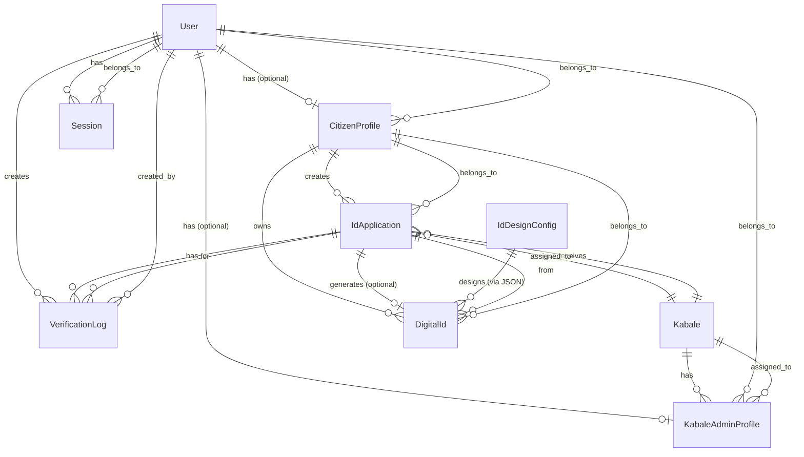

# Database Schema Documentation

## Table of Contents

- [Overview](#overview)
- [Entity Relationship Diagram](#entity-relationship-diagram)
- [Enums](#enums)
- [Models](#models)
- [Relationships](#relationships)
- [Indexes](#indexes)
- [Constraints](#constraints)
- [Migration Guide](#migration-guide)

## Overview

The Kabale Digital ID Card system uses MySQL/MariaDB as the database, managed through Prisma ORM. The schema follows a relational model with clear separation between users, profiles, applications, and digital IDs.

### Database Provider

- **Provider**: MySQL (via MariaDB adapter)
- **Character Set**: UTF-8 (utf8mb4)
- **Collation**: utf8mb4_unicode_ci

### Key Design Principles

1. **User-Centric**: All actors (citizens, admins) are Users with role-based profiles
2. **Immutable Logs**: Verification logs cannot be modified
3. **Referential Integrity**: Foreign keys ensure data consistency
4. **Cascade Deletes**: User deletion cascades to related data
5. **Restrict Deletes**: Prevent deletion of entities with dependencies

## Entity Relationship Diagram



## Enums

### UserRole

Defines the three user roles in the system.

```typescript
enum UserRole {
  SYSTEM_ADMIN    // Full system access
  KABALE_ADMIN    // Single Kabale access
  CITIZEN         // Own data only
}
```

**Usage**: Stored in `User.role` field. Determines access permissions and available features.

### IdApplicationStatus

Tracks the lifecycle of ID applications.

```typescript
enum IdApplicationStatus {
  DRAFT                    // Created but not submitted
  SUBMITTED                // Submitted for review
  PENDING_VERIFICATION     // Awaiting in-person verification
  APPROVED                 // Verified and approved
  REJECTED                 // Verified but rejected
}
```

**State Transitions**:
- `DRAFT` → `SUBMITTED` (citizen submits)
- `SUBMITTED` → `PENDING_VERIFICATION` (admin moves to verification)
- `PENDING_VERIFICATION` → `APPROVED` (admin approves)
- `PENDING_VERIFICATION` → `REJECTED` (admin rejects)

### DigitalIdStatus

Tracks the status of issued digital IDs.

```typescript
enum DigitalIdStatus {
  ACTIVE      // Valid and active
  REVOKED     // Revoked by system admin
  EXPIRED     // Expired (if expiration configured)
}
```

**Note**: Only one ACTIVE DigitalId per citizen at a time.

### VerificationResult

Result of in-person verification.

```typescript
enum VerificationResult {
  APPROVED    // Verification successful
  REJECTED    // Verification failed
}
```

**Immutable**: Once created, VerificationLog records cannot be modified.

## Models

### User

Base user entity for all system actors.

| Field | Type | Constraints | Description |
|-------|------|-------------|-------------|
| `id` | String | Primary Key, CUID | Unique user identifier |
| `email` | String | Unique, Indexed | User email address |
| `phone` | String? | Unique, Indexed | User phone number (optional) |
| `passwordHash` | String | Required | Argon2 hashed password |
| `firstName` | String? | Optional | User's first name |
| `lastName` | String? | Optional | User's last name |
| `role` | UserRole | Required, Indexed | User role (SYSTEM_ADMIN, KABALE_ADMIN, CITIZEN) |
| `createdAt` | DateTime | Auto | Account creation timestamp |
| `updatedAt` | DateTime | Auto | Last update timestamp |

**Relations**:
- `kabaleAdminProfile` (optional one-to-one)
- `citizenProfile` (optional one-to-one)
- `verificationLogs` (one-to-many)
- `sessions` (one-to-many)

**Indexes**:
- `email` (unique)
- `phone` (unique, nullable)
- `role`

**Business Rules**:
- At least one of `email` or `phone` must be provided
- Password must be hashed using Argon2
- Role determines which profile type can exist

### Kabale

Local administrative unit where citizens apply for IDs.

| Field | Type | Constraints | Description |
|-------|------|-------------|-------------|
| `id` | String | Primary Key, CUID | Unique Kabale identifier |
| `name` | String | Required, Indexed | Kabale name |
| `address` | String? | Optional | Physical address |
| `createdAt` | DateTime | Auto | Creation timestamp |
| `updatedAt` | DateTime | Auto | Last update timestamp |

**Relations**:
- `admins` (one-to-many: KabaleAdminProfile)
- `idApplications` (one-to-many: IdApplication)

**Indexes**:
- `name`

**Business Rules**:
- Cannot be deleted if it has applications (Restrict constraint)
- Can have multiple admins
- Name should be unique (enforced at application level)

### KabaleAdminProfile

Profile linking a user to their assigned Kabale.

| Field | Type | Constraints | Description |
|-------|------|-------------|-------------|
| `id` | String | Primary Key, CUID | Unique profile identifier |
| `userId` | String | Unique, Foreign Key | Reference to User |
| `kabaleId` | String | Foreign Key, Indexed | Reference to Kabale |
| `phone` | String? | Optional | Contact phone |
| `createdAt` | DateTime | Auto | Creation timestamp |
| `updatedAt` | DateTime | Auto | Last update timestamp |

**Relations**:
- `user` (many-to-one: User, Cascade delete)
- `kabale` (many-to-one: Kabale, Restrict delete)

**Indexes**:
- `userId` (unique)
- `kabaleId`

**Business Rules**:
- One user can only have one KabaleAdminProfile
- User must have role `KABALE_ADMIN`
- Cannot delete Kabale if admins exist (Restrict on Kabale)

### CitizenProfile

Profile containing citizen's personal information.

| Field | Type | Constraints | Description |
|-------|------|-------------|-------------|
| `id` | String | Primary Key, CUID | Unique profile identifier |
| `userId` | String | Unique, Foreign Key | Reference to User |
| `dateOfBirth` | DateTime | Required | Citizen's date of birth |
| `gender` | String? | Optional | Gender identifier |
| `phone` | String? | Optional | Contact phone |
| `address` | String? | Optional | Residential address |
| `photoUrl` | String? | Optional | Profile photo URL |
| `createdAt` | DateTime | Auto | Creation timestamp |
| `updatedAt` | DateTime | Auto | Last update timestamp |

**Relations**:
- `user` (many-to-one: User, Cascade delete)
- `idApplications` (one-to-many: IdApplication)
- `digitalIds` (one-to-many: DigitalId)

**Indexes**:
- `userId` (unique)

**Business Rules**:
- One user can only have one CitizenProfile
- User must have role `CITIZEN`
- Required for ID application submission

### IdApplication

Application for a digital ID card.

| Field | Type | Constraints | Description |
|-------|------|-------------|-------------|
| `id` | String | Primary Key, CUID | Unique application identifier |
| `citizenId` | String | Foreign Key, Indexed | Reference to CitizenProfile |
| `kabaleId` | String | Foreign Key, Indexed | Selected Kabale |
| `status` | IdApplicationStatus | Default: DRAFT, Indexed | Application status |
| `submittedAt` | DateTime? | Optional, Indexed | Submission timestamp |
| `createdAt` | DateTime | Auto | Creation timestamp |
| `updatedAt` | DateTime | Auto | Last update timestamp |

**Relations**:
- `citizenProfile` (many-to-one: CitizenProfile, Cascade delete)
- `kabale` (many-to-one: Kabale, Restrict delete)
- `digitalId` (optional one-to-one: DigitalId)
- `verificationLogs` (one-to-many: VerificationLog)

**Indexes**:
- `citizenId`
- `kabaleId`
- `status`
- `submittedAt`

**Business Rules**:
- Status transitions follow defined workflow
- Only one application can be in non-rejected state per citizen
- Cannot delete Kabale if applications exist (Restrict)

### DigitalId

Issued digital ID card.

| Field | Type | Constraints | Description |
|-------|------|-------------|-------------|
| `id` | String | Primary Key, CUID | Unique ID identifier |
| `applicationId` | String | Unique, Foreign Key | Reference to IdApplication |
| `citizenId` | String | Foreign Key, Indexed | Reference to CitizenProfile |
| `status` | DigitalIdStatus | Default: ACTIVE, Indexed | ID status |
| `issuedAt` | DateTime | Auto | Issue timestamp |
| `expiresAt` | DateTime? | Optional | Expiration date |
| `revokedAt` | DateTime? | Optional | Revocation timestamp |
| `revokedBy` | String? | Optional | User ID who revoked |
| `revokedReason` | String? | Optional | Reason for revocation |
| `createdAt` | DateTime | Auto | Creation timestamp |
| `updatedAt` | DateTime | Auto | Last update timestamp |

**Relations**:
- `application` (one-to-one: IdApplication, Cascade delete)
- `citizen` (many-to-one: CitizenProfile, Cascade delete)

**Indexes**:
- `citizenId`
- `status`
- `applicationId` (unique)

**Business Rules**:
- Created automatically when application is approved
- Only one ACTIVE DigitalId per citizen
- Revocation requires system admin role
- Expiration is optional (can be null for permanent IDs)

### VerificationLog

Immutable log of verification actions.

| Field | Type | Constraints | Description |
|-------|------|-------------|-------------|
| `id` | String | Primary Key, CUID | Unique log identifier |
| `applicationId` | String | Foreign Key, Indexed | Reference to IdApplication |
| `verifiedBy` | String | Foreign Key, Indexed | User who performed verification |
| `result` | VerificationResult | Required | Verification result |
| `notes` | String? | Optional | Verification notes |
| `verifiedAt` | DateTime | Auto, Indexed | Verification timestamp |
| `createdAt` | DateTime | Auto | Creation timestamp |

**Relations**:
- `application` (many-to-one: IdApplication, Cascade delete)
- `verifier` (many-to-one: User, Restrict delete)

**Indexes**:
- `applicationId`
- `verifiedBy`
- `verifiedAt`

**Business Rules**:
- **Immutable**: Cannot be updated or deleted
- Created for every verification action
- Links to both application and verifier user
- Timestamped for audit trail

### Session

User session for authentication.

| Field | Type | Constraints | Description |
|-------|------|-------------|-------------|
| `id` | String | Primary Key, CUID | Unique session identifier |
| `userId` | String | Foreign Key, Indexed | Reference to User |
| `token` | String | Unique, Indexed | Session token |
| `expiresAt` | DateTime | Required, Indexed | Expiration timestamp |
| `createdAt` | DateTime | Auto | Creation timestamp |
| `updatedAt` | DateTime | Auto | Last update timestamp |

**Relations**:
- `user` (many-to-one: User, Cascade delete)

**Indexes**:
- `token` (unique)
- `userId`
- `expiresAt`

**Business Rules**:
- Token must be unique
- Expired sessions should be cleaned up
- Cascade delete when user is deleted

### IdDesignConfig

Configuration for ID card design.

| Field | Type | Constraints | Description |
|-------|------|-------------|-------------|
| `id` | String | Primary Key, CUID | Unique config identifier |
| `config` | Json | Required | Design configuration JSON |
| `isActive` | Boolean | Default: true, Unique | Active configuration flag |
| `createdAt` | DateTime | Auto | Creation timestamp |
| `updatedAt` | DateTime | Auto | Last update timestamp |

**Relations**: None (standalone configuration)

**Indexes**:
- `isActive` (unique, ensures only one active config)

**Business Rules**:
- Only one active configuration at a time
- Config stored as JSON for flexibility
- Used for PDF ID card generation

## Relationships

### One-to-One Relationships

1. **User ↔ CitizenProfile**: Optional, one user can have one citizen profile
2. **User ↔ KabaleAdminProfile**: Optional, one user can have one Kabale admin profile
3. **IdApplication ↔ DigitalId**: Optional, one application can generate one digital ID

### One-to-Many Relationships

1. **User → Sessions**: One user can have many sessions
2. **User → VerificationLogs**: One user can create many verification logs
3. **Kabale → KabaleAdminProfiles**: One Kabale can have many admins
4. **Kabale → IdApplications**: One Kabale can receive many applications
5. **CitizenProfile → IdApplications**: One citizen can create many applications
6. **CitizenProfile → DigitalIds**: One citizen can have many digital IDs (historical)
7. **IdApplication → VerificationLogs**: One application can have many verification logs

### Delete Behaviors

- **Cascade Delete**: When parent is deleted, children are deleted
  - User → CitizenProfile, KabaleAdminProfile, Sessions, VerificationLogs
  - CitizenProfile → IdApplications, DigitalIds
  - IdApplication → DigitalId, VerificationLogs

- **Restrict Delete**: Prevents deletion if children exist
  - Kabale → IdApplications (cannot delete Kabale with applications)
  - User → VerificationLogs (cannot delete user who created logs)

## Indexes

### Performance Indexes

Indexes are created on frequently queried fields:

- **User**: `email`, `phone`, `role`
- **Kabale**: `name`
- **KabaleAdminProfile**: `userId`, `kabaleId`
- **CitizenProfile**: `userId`
- **IdApplication**: `citizenId`, `kabaleId`, `status`, `submittedAt`
- **DigitalId**: `citizenId`, `status`, `applicationId`
- **VerificationLog**: `applicationId`, `verifiedBy`, `verifiedAt`
- **Session**: `token`, `userId`, `expiresAt`

### Unique Constraints

- `User.email` (unique)
- `User.phone` (unique, nullable)
- `User.id` (primary key)
- `KabaleAdminProfile.userId` (unique)
- `Session.token` (unique)
- `IdDesignConfig.isActive` (unique, ensures single active config)

## Constraints

### Foreign Key Constraints

All foreign keys enforce referential integrity:

```sql
-- Example: CitizenProfile must reference valid User
FOREIGN KEY (userId) REFERENCES User(id) ON DELETE CASCADE

-- Example: IdApplication cannot reference deleted Kabale
FOREIGN KEY (kabaleId) REFERENCES Kabale(id) ON DELETE RESTRICT
```

### Check Constraints

Business logic constraints (enforced at application level):

1. **User Role-Profile Consistency**:
   - SYSTEM_ADMIN: No profile
   - KABALE_ADMIN: Must have KabaleAdminProfile
   - CITIZEN: Must have CitizenProfile

2. **Single Active Digital ID**:
   - Only one ACTIVE DigitalId per citizen (enforced in application code)

3. **Application Status Transitions**:
   - Status changes follow defined workflow (enforced in application code)

## Migration Guide

### Creating Migrations

```bash
# Create a new migration
pnpm prisma migrate dev --name your_migration_name

# Apply migrations in production
pnpm prisma migrate deploy
```

### Migration Best Practices

1. **Always Review Generated SQL**: Check migration files before applying
2. **Test in Development First**: Never apply untested migrations to production
3. **Backup Before Migration**: Always backup production database
4. **Use Transactions**: Prisma migrations run in transactions
5. **Handle Data Migrations**: For schema changes requiring data transformation, create custom migration scripts

### Common Migration Scenarios

#### Adding a New Field

```prisma
// schema.prisma
model User {
  // ... existing fields
  middleName String?  // New optional field
}
```

```bash
pnpm prisma migrate dev --name add_user_middle_name
```

#### Adding a Relationship

```prisma
model User {
  // ... existing fields
  notifications Notification[]  // New relationship
}
```

#### Modifying Enum

```prisma
enum UserRole {
  SYSTEM_ADMIN
  KABALE_ADMIN
  CITIZEN
  MODERATOR  // New role
}
```

**Note**: Enum modifications may require data migration for existing records.

### Data Migration Example

For complex data transformations, create a migration script:

```typescript
// prisma/migrations/XXXXX_data_migration/migrate.ts
import { PrismaClient } from '@prisma/client';

const prisma = new PrismaClient();

async function main() {
  // Transform existing data
  await prisma.user.updateMany({
    where: { role: 'OLD_ROLE' },
    data: { role: 'NEW_ROLE' },
  });
}

main()
  .catch(console.error)
  .finally(() => prisma.$disconnect());
```

## Database Maintenance

### Regular Maintenance Tasks

1. **Clean Expired Sessions**: Periodically delete expired sessions
2. **Archive Old Data**: Consider archiving old applications and logs
3. **Update Statistics**: Run `ANALYZE TABLE` for query optimization
4. **Monitor Index Usage**: Review and optimize indexes based on query patterns

### Backup Strategy

1. **Regular Backups**: Daily automated backups
2. **Before Migrations**: Always backup before schema changes
3. **Point-in-Time Recovery**: Enable binary logging for point-in-time recovery
4. **Test Restores**: Regularly test backup restoration

## Query Optimization Tips

1. **Use Indexes**: Always query on indexed fields when possible
2. **Selective Includes**: Only include related data you need
3. **Pagination**: Use `take` and `skip` for large result sets
4. **Batch Operations**: Use `createMany`, `updateMany` for bulk operations
5. **Connection Pooling**: Prisma handles connection pooling automatically

For more information on Prisma queries, see [Prisma Documentation](https://www.prisma.io/docs/concepts/components/prisma-client).

